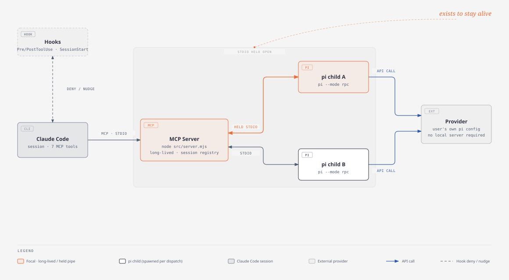
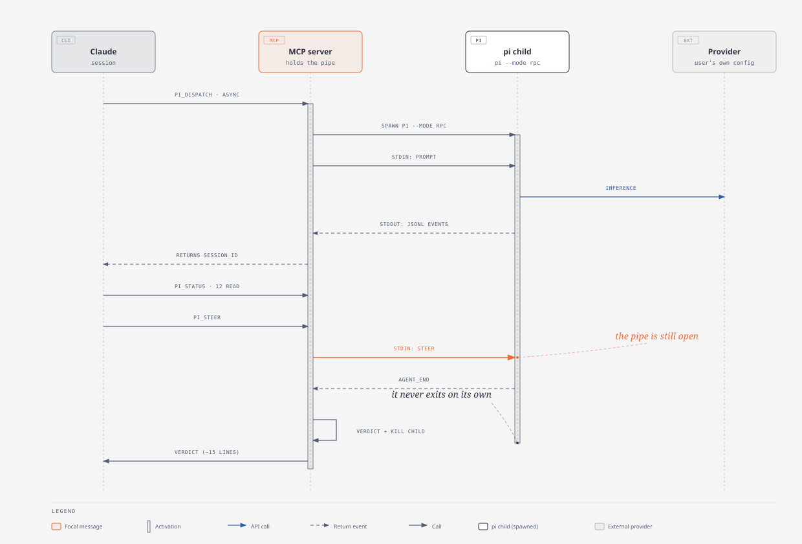

# pi-delegate

Delegate implementation and tests to a local
[`pi`](https://www.npmjs.com/package/@earendil-works/pi-coding-agent) agent, with hooks that
enforce dispatch discipline.

Claude acts as tech lead: it produces the probe, the task book, the acceptance script, and the
verdict. **pi writes the source code.**



*Claude never speaks the RPC protocol directly — the MCP server holds the pipe, which is what makes mid-run `pi_steer` and `pi_abort` possible.*

## Install

```
/plugin marketplace add LarryStanley/pi-delegate
/plugin install pi-delegate@pi-delegate
```

Run both inside Claude Code. The first command registers this repository as a plugin
marketplace; the second installs the plugin from it. If the install summary says
`Run /reload-plugins to activate.`, run that too.

Requires Node ≥ 22 and a `pi` installation that is already set up. Dependencies are
installed automatically from the committed lockfile — there is nothing to `npm install`
yourself.

To update later:

```
/plugin marketplace update pi-delegate
```

<details>
<summary>Local development install</summary>

To run a working copy instead of the published version:

```bash
claude --plugin-dir /path/to/pi-delegate
```

A `--plugin-dir` copy takes precedence over the installed one for that session, so you can
test changes without uninstalling.

</details>

Then run `/pi-delegate:setup` for a guided first-run walkthrough: it checks `pi` and its
provider, explains the discipline modes and asks which one you want, offers to fix anything
fixable, and offers a verification dispatch before you start using the tools for real.

## Configuration: nothing is required by default

`pi_dispatch` **specifies no provider or model**, so pi uses your own default
(`defaultProvider` / `defaultModel` in `~/.pi/agent/settings.json`). In other words:
whatever model you already point pi at, dispatches go there too — anthropic, openai, litellm,
ollama, LM Studio, or a local OpenAI-compatible server (e.g. omlx) all work the same way, with
nothing to configure for this plugin specifically.

If you want to pin a different model long-term (for example, a cheap local model dedicated to
dispatches while interactive pi uses something else), write
`~/.claude/pi-delegate/config.json`:

```json
{
  "provider": "ollama",
  "model": "qwen3:8b",
  "timeout_s": 1500,
  "thinking": "off",
  "tools": "read,write,edit",
  "no_context_files": true,
  "drafter_patterns": ["-draft", "_assistant", "-assistant"]
}
```

Every field is optional. Resolution order is **`pi_dispatch` call arguments → this file → pi's
own defaults**.

`/pi-delegate:doctor` tells you which model a dispatch will actually reach, and raises a
problem only under conditions that genuinely hold.

### The defaults below were measured, not guessed

| Parameter | Default | Why |
|---|---|---|
| `thinking` | `off` | Small local models spend their whole thinking budget and never emit a single tool call. Strong hosted models do benefit from thinking on hard problems, so it's overridable. |
| `tools` | `read,write,edit` | Granting `bash` made the model roam endlessly with `ls` / `cat` instead of writing anything. |
| `no_context_files` | `true` | Measured: without it, 43 reads / 0 writes / timed out; with it, finished in 93 seconds. |

To override, specify it directly in the `pi_dispatch` call (`thinking`, `tools`,
`no_context_files`, `append_system_prompt`, `provider`, `model`, `timeout_s`).

`--mode rpc`, `--session-id`, `--no-skills`, and `--no-extensions` are structural and not
overridable; `--no-session` is **deliberately never passed** (omitting it is what makes the
session land on disk, which is what gives `pi_transcript` something to read).

## Modes

| Mode | Behavior |
|---|---|
| `off` | No intervention at all |
| `soft` | Nudges when existing product code is touched (default) |
| `strict` | Blocks edits to existing product code |

Switch modes with `/pi-delegate:mode <mode>`; state lives in `~/.claude/pi-delegate/modes.json`,
remembered per project. "Existing product code" means a source file that already exists under
the project root's `src/`; `tasks/`, `scripts/`, `docs/`, markdown, config files, and brand-new
files are all allowed through.

`strict` is a discipline guardrail, not enforcement: the hook is only wired to `Write|Edit`, so
editing the same file with `Bash` (`sed -i`, a heredoc, `python - <<EOF`, …) is never intercepted.
There's always a way around it — it blocks editing the file yourself out of habit, not a
deliberate workaround.

To make one hand-edit (a probe), run `/pi-delegate:probe` first for a one-time bypass.

## MCP tools

| Tool | Purpose |
|---|---|
| `pi_dispatch` | Dispatch a task book. `mode=sync` waits for the result, `mode=async` runs it in the background |
| `pi_status` | Check progress — **the reliable mechanism**; also reports when no notification watcher is attached |
| `pi_steer` | Interject mid-run when it's heading the wrong way |
| `pi_abort` | Abort. **Re-dispatch an aborted task unchanged; only rewrite the task book after a real failure** |
| `pi_result` | Collect the verdict of an async dispatch |
| `pi_transcript` | Drill in only when the verdict isn't enough |
| `pi_stats` | Check token usage |

`pi_dispatch` also takes `resume_session_id` to continue an earlier dispatch instead of
starting fresh — pi keeps the previous turns, which is what makes `/pi-delegate:discuss`
a conversation rather than a question box.

## Consulting pi instead of delegating to it

Everything above hands pi characters you would otherwise type. These two do the opposite:
pi writes nothing, and the output is its opinion.

| Command | Purpose |
|---|---|
| `/pi-delegate:review [ref\|files]` | A second reviewer on a diff. pi writes structured findings; Claude then **checks each one against the code** and reports them as confirmed / false / undecided |
| `/pi-delegate:discuss <question>` | Think a problem through over as many turns as it takes, with `resume_session_id` carrying the thread |

Both are slash commands rather than MCP tools, deliberately. An MCP tool's schema is paid
in every context whether or not it is ever called; a skill costs nothing until you invoke
it. Review and discussion are things you start on purpose, so they belong on the side of
that line that is free when idle.

The review command does not fix anything it finds. Reviewing and fixing in one motion is
how a wrong finding becomes a committed change — confirmed findings become a task book,
and go back through a normal dispatch.

## Dispatching behind a critic gate

`/pi-delegate:critique <task>` is a normal dispatch with one thing added: the work does not
count as done because pi said it was done.

| Role | Who | Sees |
|---|---|---|
| Contract | Claude, **written before anything is dispatched** | the task |
| Generator | a pi session | the task and the contract |
| Critic | a **second, independent** pi session, new every round | the contract and the diff — never the generator's reasoning |
| Judge | Claude | the real code |

A REJECT goes back to the generator via `resume_session_id`, for **at most three rounds**. Two
asymmetries make that loop terminate: the generator resumes each round while the critic is
always a fresh session (a critic carrying its own last verdict checks that its complaints were
addressed instead of re-reading the code), and only a finding that names a contract item can
block (a fresh critic can always produce new opinions, so unbounded scope means it never
converges). Three rounds without convergence is reported as a contract defect rather than
retried a fourth time.

The critic's ACCEPT is evidence, not the gate — Claude still walks the contract against the
real code, because two models agreeing with each other is not verification.

Costs roughly 3-10× a plain dispatch, and against a local endpoint the rounds are serial
wall-clock. Worth it where a mistake is expensive to find later (auth, money, migrations,
public interfaces, silent failures); not worth it for internal tooling where the feedback loop
is "run it and see".

## How you learn a dispatch finished

Two channels, and only one of them is a guarantee.

**`pi_status` / `pi_result` — reliable.** The MCP server talks to pi over RPC
(`pi --mode rpc`), so it knows the outcome the moment it happens.

**The completion notification — a convenience.** MCP gives a server no way to push a message
into a conversation, so the completion is broadcast over a per-session socket to the plugin's
monitor, whose stdout Claude Code turns into a notification. Monitors run in interactive CLI
sessions only, so a headless run has no watcher at all.

The socket replaced a `tail -F` over a log file
([issues/1](https://github.com/LarryStanley/pi-delegate/issues/1)): a file gave the writer no
way to observe whether anyone was reading it, so when the reader died the completions simply
stopped and nothing said so. A connection is its own liveness signal, so `pi_dispatch` and
`pi_status` now state outright when no notification is coming, and the monitor reconnects by
itself when `/reload-plugins` restarts the server. The log file is still written — it is what
`pi_result` reads back when a reload empties the in-memory registry.

## Seeing a dispatch while it runs

`/pi-delegate:statusline` adds a row to the Claude Code status line that exists only while a pi
dispatch is in flight:

```
● pi ⇢ 2 running · 2 sessions · 3m12s · Qwen3.8-27B
```

The count is **machine-wide, not per-session**, on purpose. Every dispatch on this machine
reaches the same endpoint, so what you need to know before starting another one is how many are
already running anywhere — including in your other Claude Code window. The elapsed time is the
oldest one still going, and it turns yellow at 5 minutes and red at 15, because "someone has
been holding the endpoint for 18 minutes" should not require reading the line to notice.

The leading dot breathes on a 10-second cycle. Its phase comes from the wall clock rather than
a frame counter, so it looks the same whatever cadence Claude Code happens to rerun the status
line at, and does not freeze mid-animation when the session goes quiet.

Three constraints shaped how this is installed, none of them ours:

- **Claude Code allows exactly one `statusLine`**, and a plugin's own `settings.json` may only
  contain `agent` and `subagentStatusLine`. Adding this means writing to the user's global
  settings, so `/pi-delegate:statusline` **probes the existing command by running it**, shows
  before and after, backs up `settings.json`, and composes rather than replaces — the existing
  status line runs untouched and the pi row goes underneath it.
- **It needs `refreshInterval`.** Event-driven redraws go quiet while the session is idle, which
  is exactly when an async dispatch is running. The timer reruns the *whole* status line
  including the user's own, so the cost is stated up front rather than discovered.
- **It cannot live in the subagent panel.** `subagentStatusLine` can override or hide the rows
  Claude Code already renders for its own subagents, but there is no way to add one, and a pi
  dispatch is not a Claude Code subagent.

`scripts/statusline.sh` is a standalone reference implementation as well as the installed one:
everything above `render` gathers facts, and `render` alone decides how they look. Edit `render`
in your own copy (`~/.claude/pi-delegate/statusline.sh`) and nothing can break except the
appearance.

It is bash rather than Node deliberately. On every tick, a Node process that does nothing but
read one small file measured 40-60ms of interpreter startup against ~100ms for a full powerline
render — a 50% latency increase for one line of text. The status file is written as flat
`key=value` pairs so bash can read it with word splitting and no parser.

## How a dispatch works



*The MCP server's activation spans the whole session; that's why it can still deliver a `steer` to the pi child's stdin mid-run, and why it — not the child process — decides when the run is over.*

## Known gaps

`pi_stats` only returns the `tokens` and `duration_s` already present in the verdict. spec
§5's `get_session_stats` passthrough (including `cost` / `context` usage) is not yet
implemented.

## Documentation

| File | Contents |
|---|---|
| `docs/publish-prep-report.md` | Changes and verification notes from the pre-release pass |
| `docs/superpowers/specs/2026-08-22-pi-delegate-plugin-design.md` | Design spec (historical) |
| `docs/superpowers/plans/2026-08-22-pi-delegate-plugin.md` | Implementation plan (historical) |
| `skills/delegating-to-pi/` | The dispatch discipline itself: the four-way split, task books, acceptance, model choice |
| `skills/review/` | The second-opinion review flow, and why Claude adjudicates rather than relays |
| `skills/discuss/` | Multi-turn consultation, and why replies are kept short |
| `skills/critique/` | The bounded generator–critic loop: writing a decidable contract, why the critic never resumes, and when the gate is not worth it |
| `skills/statusline/` | Composing the pi indicator with an existing status line: probing it rather than assuming, and what `refreshInterval` costs |

## Development

```bash
npm test                    # node --test, no external dependencies
claude plugin validate .
```

`fixtures/fake-pi.mjs` stands in for `pi --mode rpc`. It deliberately lives **outside**
`test/` — `node --test` treats any file under `**/test/**/*.{cjs,mjs,js}` as a test file, and
putting it in `test/` would add one permanently-passing phantom test.
