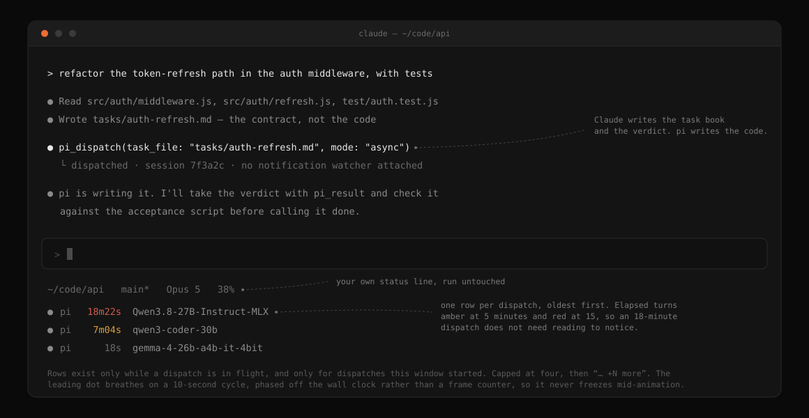

# pi-delegate

[English](README.md) · [繁體中文](README.zh-TW.md)

Call a local [`pi`](https://www.npmjs.com/package/@earendil-works/pi-coding-agent) agent from inside
Claude Code: Claude writes the task book and judges the result, pi writes the source and the tests.



*Claude reads the code and writes the contract; `pi_dispatch` hands the writing to pi. The rows under the status line are this window's dispatches, one per row, and they disappear when the last one finishes.*

Why a plugin rather than a written rule: with the rule in place, roughly 80% of the characters
committed to this repo were still typed by the main model. In `strict` mode a `PreToolUse` hook
denies Claude's own `Write` and `Edit` on existing product source and tells it to dispatch instead.

Dispatches go to whatever provider and model your `pi` is already pointed at; this plugin pins
nothing.

That rail has a hole, and it is deliberate: the hook matches `Write` and `Edit` only, so the same
edit made through `Bash` (`sed -i`, a heredoc) is never intercepted. It blocks editing a file
yourself out of habit, not a deliberate workaround.

## Install

```
/plugin marketplace add LarryStanley/pi-delegate
/plugin install pi-delegate@pi-delegate
```

Run both inside Claude Code: the first registers this repository as a plugin marketplace, the second
installs the plugin from it. If the install summary says `Run /reload-plugins to activate.`, run that
too. Requires Node ≥ 22 and a `pi` installation that is already set up; dependencies are installed
automatically from the committed lockfile, so there is nothing to `npm install` yourself.

To update later:

```
/plugin marketplace update pi-delegate
```

<details>
<summary>Local development install</summary>

```bash
claude --plugin-dir /path/to/pi-delegate
```

Runs a working copy instead of the published version. A `--plugin-dir` copy takes precedence over the
installed one for that session, so you can test changes without uninstalling.

</details>

Then run `/pi-delegate:setup`: it finds `pi` and works out which provider and model a dispatch will
actually reach, explains the discipline modes and asks which one you want, and fixes what it can. It
then offers a verification dispatch and the status line indicator, and closes with what to do next.

## Configuration: nothing is required by default

`pi_dispatch` specifies no provider or model, so dispatches land on whatever you already point pi at
(`defaultProvider` / `defaultModel` in `~/.pi/agent/settings.json`): anthropic, openai, litellm,
ollama, LM Studio, or a local OpenAI-compatible server such as omlx, all the same way.
`/pi-delegate:doctor` tells you which model a dispatch will actually reach, and only raises problems
that apply.

### The defaults below were measured, not guessed

| Parameter | Default | Why |
|---|---|---|
| `thinking` | `off` | Small local models spend their whole thinking budget and never emit a single tool call. Strong hosted models do benefit from thinking on hard problems, so it's overridable. |
| `tools` | `read,write,edit` | Granting `bash` made the model roam endlessly with `ls` / `cat` instead of writing anything. |
| `no_context_files` | `true` | Measured: without it, 43 reads / 0 writes / timed out; with it, finished in 93 seconds. |

Pinning a provider and model, the resolution order between call arguments, the config file and pi's
own defaults, and which flags are structural rather than yours to override:
[docs/configuration.md](docs/configuration.md).

## Modes

| Mode | Behavior |
|---|---|
| `off` | No intervention at all |
| `soft` | Nudges when existing product code is touched (default) |
| `strict` | Blocks edits to existing product code |

`strict` blocks `Write` and `Edit`, which is not the same as blocking edits — `sed -i` and a heredoc
walk straight past it, and `/pi-delegate:probe` clears the way for one deliberate hand-edit. What
counts as existing product code, where the per-project state lives, and where the holes are:
[docs/configuration.md](docs/configuration.md).

## MCP tools

| Tool | Purpose |
|---|---|
| `pi_dispatch` | Dispatch a task book. `mode=sync` waits for the result, `mode=async` runs it in the background |
| `pi_status` | Check progress; also reports when no notification watcher is attached |
| `pi_steer` | Interject mid-run when it's heading the wrong way |
| `pi_abort` | Abort a run in flight |
| `pi_result` | Collect the verdict of an async dispatch |
| `pi_transcript` | Drill in only when the verdict isn't enough |
| `pi_stats` | Check token usage |

## Consulting pi instead of delegating to it

Everything above hands pi characters you would otherwise type. These two do the opposite:
pi writes nothing, and the output is its opinion.

| Command | Purpose |
|---|---|
| `/pi-delegate:review [ref\|files]` | A second reviewer on a diff. pi writes structured findings; Claude then **checks each one against the code** and reports them as confirmed / false / undecided |
| `/pi-delegate:discuss <question>` | Think a problem through over as many turns as it takes, with `resume_session_id` carrying the thread |

Both are slash commands rather than MCP tools on purpose, because a tool's schema is paid in every
context and a skill costs nothing until you invoke it. That reasoning, and the rest of the plumbing
decisions, are in [docs/design-notes.md](docs/design-notes.md).

## Dispatching behind a critic gate

`/pi-delegate:critique <task>` is a normal dispatch with one thing added: the work does not
count as done because pi said it was done.

| Role | Who | Sees |
|---|---|---|
| Contract | Claude, **written before anything is dispatched** | the task |
| Generator | a pi session | the task and the contract |
| Critic | a **second, independent** pi session, new every round | the contract and the diff — never the generator's reasoning |
| Judge | Claude | the real code |

Costs roughly 3-10× a plain dispatch, and against a local endpoint the rounds are serial
wall-clock. Worth it where a mistake is expensive to find later (auth, money, migrations,
public interfaces, silent failures); not worth it for internal tooling where the feedback loop
is "run it and see".

## How you learn a dispatch finished

Two channels, and only one of them is a guarantee. **`pi_status` / `pi_result` — reliable.** The MCP
server talks to pi over RPC (`pi --mode rpc`), so it knows the outcome the moment it happens. **The
completion notification — a convenience.** MCP gives a server no way to push a message into a
conversation, so the completion goes over a per-session socket to the plugin's monitor, whose stdout
Claude Code turns into a notification, and monitors run in interactive CLI sessions only — a headless
run has no watcher at all.

The notification used to be a `tail -F` over a log file, and when the reader died the completions
stopped with nothing to say so. What that cost and what replaced it:
[docs/design-notes.md](docs/design-notes.md).

## Seeing a dispatch while it runs

`/pi-delegate:setup` offers this row at step 5; `/pi-delegate:statusline` adds it later if you
declined it there or skipped setup. Either way it is a row on the Claude Code status line that exists
only while a pi dispatch is in flight:

```
● pi   18m22s  Qwen3.8-27B-Instruct-MLX
● pi    7m04s  qwen3-coder-30b
```

Each row carries its own elapsed time, turning amber at 5 minutes and red at 15 on its own, which is
the point of splitting them: one 18-minute dispatch should not drag a 20-second one red alongside it.
Installing the row probes whatever status line you already have by running it, and composes rather
than replaces. Why the row is bash and not Node, why ownership travels on line 2 of the status file, and
what 0.13.0 got wrong by counting every window's dispatches:
[docs/design-notes.md](docs/design-notes.md).

## How a dispatch works


*Claude never speaks the RPC protocol directly — the MCP server holds the pipe, which is what makes mid-run `pi_steer` and `pi_abort` possible.*


*The MCP server's activation spans the whole session; that's why it can still deliver a `steer` to the pi child's stdin mid-run, and why it — not the child process — decides when the run is over.*

## Known gaps

`pi_stats` only returns the `tokens` and `duration_s` already present in the verdict. The
`get_session_stats` passthrough that would also report `cost` and `context` usage is not yet built.

## Documentation

Claude loads the skills below by itself when the situation calls for one. They are listed so you can
read what it will be told; `setup`, `doctor`, `mode` and `probe` are commands that walk you through
something rather than documents to read.

| File | Contents |
|---|---|
| `docs/configuration.md` | The config file, the resolution order, the flags you cannot override, and what the mode hook does and does not cover |
| `docs/design-notes.md` | Why the completion socket, the per-session status row, the bash status line and the two slash commands are built the way they are |
| `skills/delegating-to-pi/` | The dispatch discipline itself: the four-way split, task books, acceptance, model choice |
| `skills/review/` | The second-opinion review flow, and why Claude adjudicates rather than relays |
| `skills/discuss/` | Multi-turn consultation, and why replies are kept short |
| `skills/critique/` | The bounded generator–critic loop: writing a decidable contract, why the critic never resumes, and when the gate is not worth it |
| `skills/statusline/` | Composing the pi indicator with an existing status line: probing it rather than assuming, and what `refreshInterval` costs |

## Development

```bash
npm test                    # node --test, no external dependencies
claude plugin validate .
```

`fixtures/fake-pi.mjs` stands in for `pi --mode rpc`. It deliberately lives **outside**
`test/` — `node --test` treats any file under `**/test/**/*.{cjs,mjs,js}` as a test file, and
putting it in `test/` would add one permanently-passing phantom test.

## License

MIT. See [LICENSE](LICENSE).
